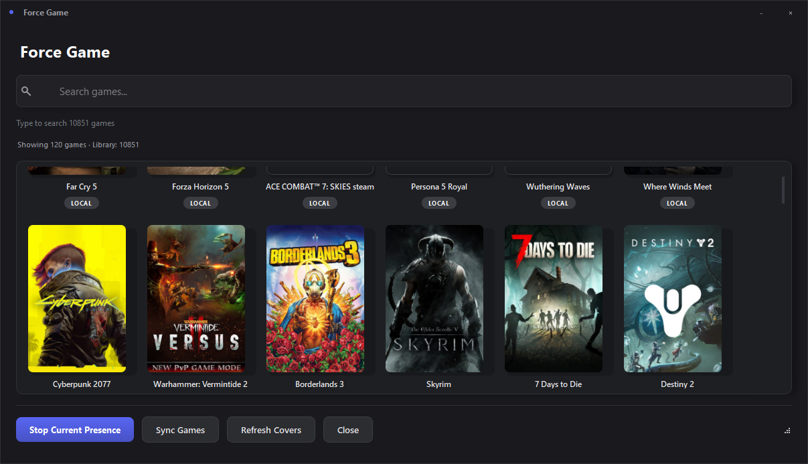

# Discord Presence Manager

<p align="center">
  
  
</p>

Discord Presence Manager is a highly polished, modern desktop tray app that lets you control what Discord displays as your current game/activity. It can force a selected game profile, apply custom Rich Presence fields, and optionally enrich status from Steam Rich Presence data.

## What the app does

- Runs in the system tray and manages Discord Rich Presence.
- Features a **Premium Dark Mode GUI** with smooth animations, custom scrollbars, drop shadows, and zero-lag startup.
- Lets you **Force Game** from your configured game list visually using game cover art.
- Can launch a fake executable name (`tools/dumb.exe`) so Discord detects the selected game executable name for testing/control scenarios.
- Supports optional Steam cookie integration to read status/group details from Steam Rich Presence.
- Provides Discord detectable-app sync to auto-fill missing `client_id` and executable mappings.
- **Optimized for Speed**: Utilizes `QThreadPool` for background image scaling, startup networking, and `rapidfuzz` for lightning-fast fuzzy searching across thousands of games.

## Requirements

- Python 3.10+
- Discord desktop app running locally
- Windows is the primary supported platform (some code paths exist for macOS/Linux)

## How to Run

There are two ways to run this project: using **uv** (recommended for speed and modern tooling) or standard **pip**.

### Option A: Using `uv` (Recommended)
If you have [uv](https://github.com/astral-sh/uv) installed, running the app is completely automated:

```bash
# 1. Install dependencies and create virtual environment automatically
uv sync

# 2. Run the application
uv run python src/main.py
```

> [!WARNING]
> **Do not** run the app directly via `python src/main.py` or `py src/main.py` if you used `uv` to install dependencies! This will execute your global Python environment which lacks the required packages, resulting in `ModuleNotFoundError`. Always use `uv run` so it correctly loads the isolated virtual environment!

### Option B: Using Standard Python (`pip`)
If you prefer standard python, you can install the dependencies manually:

```bash
# 1. Create a virtual environment (optional but recommended)
python -m venv venv
venv\Scripts\activate  # On Windows
# source venv/bin/activate  # On macOS/Linux

# 2. Install dependencies
pip install .

# 3. Run the application
python src/main.py
```

## `.env` / `CLIENT_ID` configuration

- The app includes a bundled default Discord Application Client ID: `1095416975028650046`.
- Advanced users can override it in `.env`:

  ```env
  CLIENT_ID=your_application_id
  ```

- If `CLIENT_ID` is not set in `.env`, the bundled default is used automatically.

Optional variables:

- `UPDATE_INTERVAL` (seconds, default `10`)
- `STEAM_COOKIE`
- `TEST_RICH_URL`

## Force Game usage

1. Launch the app to open the **Force Game** picker window immediately (or open it from the tray).
2. Search games quickly using the optimized search bar.
3. Click a visual card (with cover art when available) to force the activity.
4. Double-click a card to force and minimize to tray.
5. The app updates Discord presence and (when executable data exists) launches a fake executable process name for Discord detection matching.
6. Use **Stop Current Presence** to stop forced mode and clear/idle according to settings.

## Steam cookie integration (high level)

- The app can retrieve a Steam cookie via Edge WebDriver flow (runs in the background).
- Cookie is stored in `.env` for reuse.
- Steam scraper uses that cookie to fetch Rich Presence text and party/group data for supported games.
- If Steam data is available, it is used to enrich Discord presence fields.

## Build / packaging

If you package this app (for example with PyInstaller), we highly recommend building it as a **folder (`--onedir`)** instead of a single executable to prevent 3-4 second cold-start lag caused by dependency extraction:

```bash
pyinstaller --onedir --noconsole --name "Discord-Game-Presence-Manager" src/main.py
```

Ensure the following are included in your final distribution:

- `tools/dumb.exe`, `tools/msedgedriver.exe`, `assets/`, `lang/`, and `config/` resources.
- `.env` is placed next to the executable or otherwise discoverable by runtime.

## Disclaimer about fake executable mode

The fake executable mode is intended for **Discord detection testing** and manual presence control workflows. Use responsibly and only in environments where this behavior is acceptable.

## Cover image resolution and cache

Cover priority:

1. Cached local cover (`config/cache/game_art/`)
2. Steam CDN cover (when `steam_appid` exists)
3. SteamGridDB (optional)
4. Placeholder card with game title

Cache index is stored at `config/cache/game_art_index.json`. All art fetching and scaling runs completely asynchronously off the UI thread.

### Optional SteamGridDB API key

You can configure artwork lookup with either:

- setting `steamgriddb_api_key` in app settings, or
- env var `STEAMGRIDDB_API_KEY`

If no key is present, the app still works and uses other cover sources/fallback placeholders.

### App Settings (`app_settings.json`)

The application supports configuration overrides, including:

- `open_game_picker_on_startup` (default `true`)
- `minimize_to_tray_on_close` (default `true`)
- `remember_window_size` (default `true`)
- `show_recent_games_first` (default `true`)
- `enable_game_art_download` (default `true`)
- `steamgriddb_api_key` (default empty)
- `game_art_cache_days` (default `30`)

Set `open_game_picker_on_startup` to `false` to keep tray-only startup behavior.
